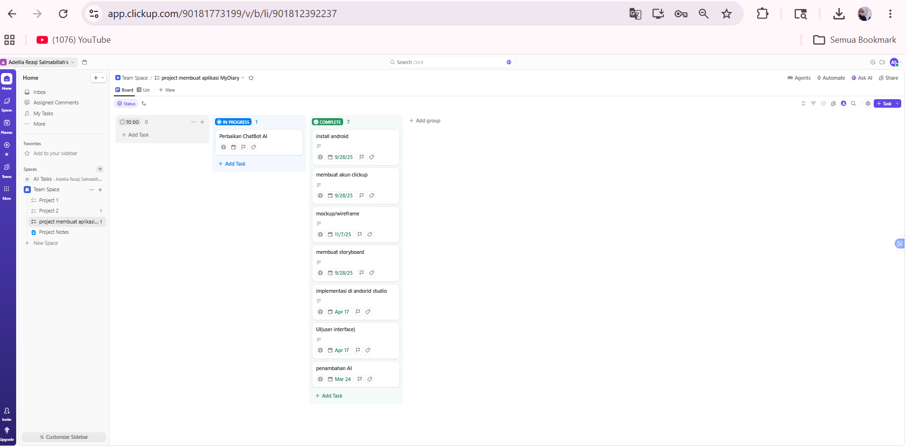
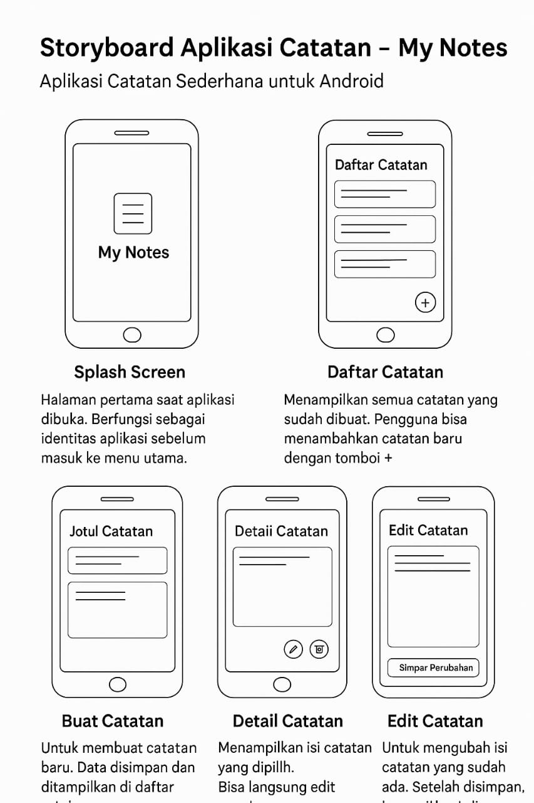
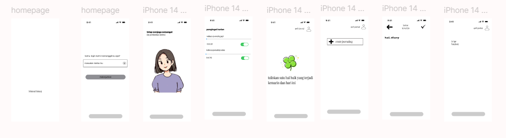
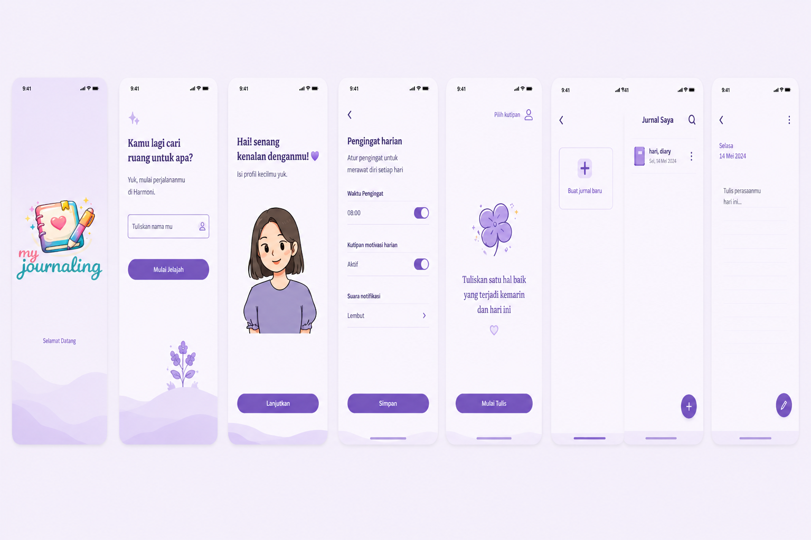

# My Diary Adel 
# Project UTS Pemrograman Mobile 2
**Nama:** Adellia Rezqi Salmabillah
**NIM:** 312410395
**Kelas:** TI.24.A4/I241D
# My Diary Adel: Smart Offline Journaling

**My Diary Adel** adalah aplikasi buku harian digital berbasis Android yang dirancang sebagai ruang aman bagi pengguna untuk mencatatkan perasaan, rahasia, dan refleksi harian. Aplikasi ini memiliki keunggulan utama berupa **Adel AI**, asisten virtual cerdas yang bekerja sepenuhnya secara luring (*offline*) untuk menjaga privasi pengguna.

---

##  Dokumentasi Perancangan (System Design)

Berikut adalah tahapan perancangan aplikasi My Diary Adel, mulai dari manajemen proyek hingga hasil akhir antarmuka:

### 1. Manajemen Proyek (ClickUp)
Kami menggunakan ClickUp untuk melacak progres pengembangan, pembagian tugas, dan *timeline* pengerjaan agar proyek selesai tepat waktu.

### 2. Storyboard
Alur cerita dan pengalaman pengguna (*User Journey*) dirancang untuk memastikan interaksi yang emosional dan intuitif antara user dan Adel AI.

### 3. Wireframe & Mockup
Tahap perancangan cetak biru (*blueprint*) aplikasi untuk menentukan tata letak elemen sebelum masuk ke tahap pengkodean.

### 4. User Interface (Final UI)
Hasil akhir desain antarmuka yang diimplementasikan ke dalam kode XML Android Studio dengan tema *Soft Pink* yang menenangkan.

---

## Fitur Unggulan

- **Offline Adel AI**: Chatbot cerdas yang memberikan respon emosional berdasarkan curhatan pengguna tanpa perlu koneksi internet.
- **Guided Journaling**: Memberikan pertanyaan pemantik (*prompts*) setiap hari untuk membantu pengguna memulai tulisan.
- **Privacy First**: Semua data disimpan secara lokal menggunakan database SQLite. Tidak ada data yang dikirim ke server luar.
- **Daily Reminders**: Fitur notifikasi untuk membangun kebiasaan menulis secara konsisten setiap pagi dan malam.

---

## 🛠️ Spesifikasi Teknis

- **Bahasa**: Java
- **Database**: SQLite (Local Storage)
- **UI Framework**: Android Material Design
- **Logika AI**: Massive Keyword Grouping & Pattern Matching
- **Target SDK**: Android 14 (API 34)

---

## 📁 Struktur Proyek
